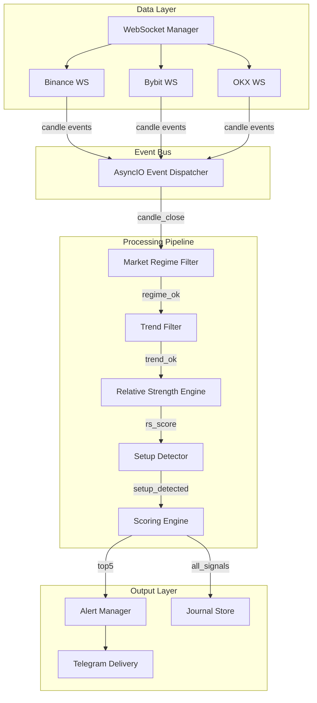
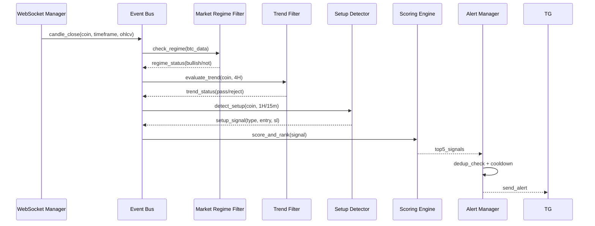

# Design Document: Crypto Momentum Scanner

## Overview

This design transforms the existing polling-based REST crypto scanner into a websocket-streaming, event-driven momentum scanning engine. The system detects Compression Breakout and Pullback Continuation setups using deterministic, rule-based logic with no AI involvement in signal generation.

### Key Architectural Shifts

1. **Data Ingestion**: REST polling → Websocket streaming (Binance primary, Bybit/OKX secondary)
2. **Processing Model**: Periodic full rescan → Event-driven incremental processing per coin/timeframe
3. **Signal Detection**: Generic multi-strategy → Two focused setup types (Compression Breakout, Pullback Continuation)
4. **Scoring**: AI-hybrid scoring → Fixed deterministic formula with transparent weights
5. **Alert Deduplication**: Time-based cooldown → Stateful cache with volume-based override logic

### Design Principles

- **Determinism**: Identical inputs produce identical outputs regardless of AI availability
- **Low Latency**: Sub-500ms pipeline from websocket event to scored result
- **Incremental Processing**: Only affected coin/timeframe is reprocessed on each event
- **Fail-Safe**: Graceful degradation with exchange failover and state preservation

---

## Architecture

### High-Level Architecture



### Event Flow



### Module Dependency Map

| New Module | Replaces/Extends | Purpose |
|---|---|---|
| `streaming/websocket_manager.py` | `collectors/__init__.py` (REST) | WebSocket connections + reconnection |
| `streaming/event_bus.py` | Scanner polling loop | Async event dispatch |
| `streaming/candle_aggregator.py` | N/A (new) | Build candles from trade/kline streams |
| `filters/market_regime_filter.py` | `engines/market_regime_engine.py` | BTC 5-condition gate |
| `filters/trend_filter.py` | `filters/__init__.py` (BitcoinFilter) | Per-coin 4H trend assessment |
| `engines/relative_strength_engine.py` | N/A (new) | RS vs BTC calculation |
| `engines/setup_detector.py` | `strategies/__init__.py` | Compression + Pullback detection |
| `engines/scoring_engine.py` | `scorer/__init__.py` | Deterministic 5-factor scoring |
| `engines/breakout_quality_scorer.py` | N/A (new) | 5-subscore breakout quality |
| `alerts/dedup_manager.py` | `alerts/signal_memory.py` | Stateful cooldown + volume override |
| `storage/journal_store.py` | `learning/` (partial) | Signal + rejection persistence |
| `storage/analytics_engine.py` | `engines/optimization_engine.py` | Performance analytics |

---

## Components and Interfaces

### 1. WebSocket Manager (`streaming/websocket_manager.py`)

```python
@dataclass
class WebSocketConfig:
    exchange: str  # "binance", "bybit", "okx"
    url: str
    symbols: List[str]
    timeframes: List[str]  # ["4h", "1h", "15m"]
    max_reconnect_attempts: int = 5
    initial_reconnect_delay: float = 1.0
    connection_timeout: float = 10.0

class WebSocketManager:
    """Manages websocket connections to multiple exchanges."""

    async def connect(self, config: WebSocketConfig) -> None:
        """Establish websocket connection within 10 seconds."""

    async def disconnect(self, exchange: str) -> None:
        """Gracefully close connection for an exchange."""

    async def reconnect(self, exchange: str) -> bool:
        """Reconnect with exponential backoff (1s initial, 5 attempts max)."""

    def on_message(self, callback: Callable[[RawMessage], Awaitable[None]]) -> None:
        """Register message handler for incoming data."""

    async def failover(self, failed_exchange: str) -> bool:
        """Switch to secondary exchange, preserving pending states."""

    @property
    def is_connected(self) -> Dict[str, bool]:
        """Connection status per exchange."""
```

### 2. Event Bus (`streaming/event_bus.py`)

```python
@dataclass
class CandleCloseEvent:
    symbol: str
    timeframe: str
    candle: OHLCV
    exchange: str
    received_at: datetime

@dataclass
class ConnectionFailureEvent:
    exchange: str
    reason: str
    timestamp: datetime

class EventBus:
    """Async event dispatcher for the scanner pipeline."""

    def subscribe(self, event_type: str, handler: Callable) -> None:
        """Register handler for event type."""

    async def publish(self, event_type: str, event: Any) -> None:
        """Dispatch event to all subscribers within 50ms."""

    async def publish_batch(self, events: List[Tuple[str, Any]]) -> None:
        """Dispatch multiple events, deduplicating stale per-coin events."""
```

### 3. Candle Aggregator (`streaming/candle_aggregator.py`)

```python
class CandleAggregator:
    """Builds and validates candles from websocket kline streams."""

    def process_kline(self, raw: dict) -> Optional[CandleCloseEvent]:
        """Process raw kline message; emit event only on candle close."""

    def validate_candle(self, candle: OHLCV) -> bool:
        """Reject zero volume or malformed fields."""

    def get_candle_history(self, symbol: str, timeframe: str) -> List[OHLCV]:
        """Return rolling candle buffer (min 200 candles)."""
```

### 4. Market Regime Filter (`filters/market_regime_filter.py`)

```python
@dataclass
class RegimeConditions:
    trend: bool       # BTC price > EMA200 (4H)
    momentum: bool    # BTC EMA20 > EMA50 (4H)
    direction: bool   # BTC EMA200 current > EMA200 5 candles ago (4H)
    volatility: bool  # BTC ATR(14)/price between 1.0%-3.0% (4H)
    breadth: bool     # >50% coins with positive 24h change

@dataclass
class RegimeResult:
    is_bullish: bool
    conditions: RegimeConditions
    status: str  # "bullish", "not_bullish", "indeterminate"

class MarketRegimeFilter:
    """BTC-based global market condition gate for LONG setups."""

    def evaluate(self, btc_candles: List[OHLCV], universe_coins: List[CoinData]) -> RegimeResult:
        """Evaluate all 5 BTC conditions. Requires >= 200 4H candles."""

    def allows_long_setups(self) -> bool:
        """True only when all 5 conditions are bullish."""
```

### 5. Trend Filter (`filters/trend_filter.py`)

```python
@dataclass
class TrendConditions:
    price_above_ema200: bool  # Close > EMA200 (4H)
    momentum_bullish: bool    # EMA20 > EMA50 (4H)
    direction_bullish: bool   # EMA200 current > EMA200 5 candles ago (4H)

@dataclass
class TrendResult:
    passes: bool
    conditions: TrendConditions
    rejection_reason: Optional[str] = None

class TrendFilter:
    """Per-coin 4H trend assessment before setup detection."""

    def evaluate(self, coin_candles_4h: List[OHLCV]) -> TrendResult:
        """Evaluate 3 trend conditions. Requires >= 200 4H candles."""
```

### 6. Relative Strength Engine (`engines/relative_strength_engine.py`)

```python
@dataclass
class RelativeStrengthScore:
    rs_4h: float          # 4H rolling RS vs BTC
    rs_24h: float         # 24H rolling RS vs BTC
    acceleration: float   # Current 4H RS - Previous 4H RS
    percentile: float     # 0-100 normalized rank
    is_stale: bool = False

class RelativeStrengthEngine:
    """Calculates coin performance relative to BTC."""

    def calculate(self, coin_candles: List[OHLCV], btc_candles: List[OHLCV]) -> RelativeStrengthScore:
        """Calculate rolling RS metrics."""

    def rank_universe(self, scores: Dict[str, RelativeStrengthScore]) -> Dict[str, float]:
        """Normalize all RS values to 0-100 percentile scale."""
```

### 7. Setup Detector (`engines/setup_detector.py`)

```python
@dataclass
class CompressionZone:
    high: float
    low: float
    candle_count: int
    start_atr14: float
    candles: List[OHLCV]
    created_at: datetime
    expired: bool = False

@dataclass
class SetupSignal:
    symbol: str
    setup_type: str  # "compression_breakout" or "pullback_continuation"
    entry_price: float
    stop_loss: float
    target_1: float
    target_2: float
    risk_reward: float
    timeframe: str
    trigger_timeframe: str  # "15m" for entry confirmation
    pending_confirmation: bool = True
    confirmation_deadline: int = 4  # 15m candles

class SetupDetector:
    """Detects Compression Breakout and Pullback Continuation patterns."""

    def detect_compression(self, candles_1h: List[OHLCV], atr14: float) -> Optional[CompressionZone]:
        """Identify compression zone (3-8 candles with ATR < 75% of ATR14)."""

    def check_breakout(self, zone: CompressionZone, candle: OHLCV, volume_ma30: float) -> Optional[SetupSignal]:
        """Check if candle breaks compression zone with volume > 1.5x MA30."""

    def detect_pullback(self, candles_1h: List[OHLCV], ema20: float, ema50: float, volume_ma30: float) -> Optional[SetupSignal]:
        """Detect pullback to EMA20/50 with bullish reclaim."""

    def confirm_15m_entry(self, signal: SetupSignal, candle_15m: OHLCV, volume_ma30_15m: float) -> bool:
        """Confirm entry on 15m timeframe with volume > 1.5x MA30."""

    def expire_stale_setups(self) -> List[SetupSignal]:
        """Expire compression zones after 12 candles, pending entries after 4x15m."""
```

### 8. Scoring Engine (`engines/scoring_engine.py`)

```python
@dataclass
class ScoringInputs:
    relative_strength: float   # 0-100 (30% weight)
    relative_volume: float     # 0-100 (25% weight)
    breakout_quality: float    # 0-100 (20% weight)
    trend_quality: float       # 0-100 (15% weight)
    market_alignment: float    # 0-100 (10% weight)

@dataclass
class ScoredSetup:
    signal: SetupSignal
    composite_score: float  # 0-100, rounded to 2 decimal places
    inputs: ScoringInputs
    oi_adjustment: float    # -20% for overcrowded, -15% for weak OI
    labels: List[str]       # ["overcrowded", "weak OI participation", etc.]

class ScoringEngine:
    """Deterministic scoring with fixed weights. No AI/ML."""

    WEIGHTS = {
        "relative_strength": 0.30,
        "relative_volume": 0.25,
        "breakout_quality": 0.20,
        "trend_quality": 0.15,
        "market_alignment": 0.10,
    }

    def score(self, inputs: ScoringInputs) -> float:
        """Calculate composite score using fixed formula."""

    def normalize_inputs(self, raw_values: Dict[str, List[float]]) -> Dict[str, float]:
        """Min-max normalize all inputs to 0-100 across current set."""

    def rank_and_select(self, setups: List[ScoredSetup]) -> List[ScoredSetup]:
        """Rank by composite score, break ties by relative_volume, return top 5."""
```

### 9. Breakout Quality Scorer (`engines/breakout_quality_scorer.py`)

```python
@dataclass
class BreakoutMetrics:
    body_ratio: float           # |close - open| / (high - low)
    close_position: float       # (close - low) / (high - low)
    range_expansion: float      # breakout range / avg compression range
    momentum_acceleration: float  # breakout % change - avg prior 3 candles % change
    relative_volume: float      # breakout volume / MA30 volume

class BreakoutQualityScorer:
    """Calculates breakout quality score from 5 sub-scores (0-100 total)."""

    def score(self, breakout_candle: OHLCV, compression_candles: List[OHLCV], volume_ma30: float) -> int:
        """Calculate total breakout quality (sum of 5 sub-scores, each 0-20)."""

    def _score_body_ratio(self, ratio: float) -> int:
        """20 if >=75%, 15 if >=60%, 10 if >=45%, 5 otherwise."""

    def _score_close_position(self, ratio: float) -> int:
        """20 if >=85%, 15 if >=70%, 10 if >=50%, 5 otherwise."""

    def _score_range_expansion(self, ratio: float) -> int:
        """20 if >=2.0, 15 if >=1.5, 10 if >=1.2, 5 otherwise."""

    def _score_momentum_acceleration(self, accel: float) -> int:
        """20 if >=2.0%, 15 if >=1.0%, 10 if >=0.5%, 5 otherwise."""

    def _score_relative_volume(self, rvol: float) -> int:
        """20 if >=2.5, 15 if >=2.0, 10 if >=1.5, 5 otherwise."""
```

### 10. Alert Manager (`alerts/dedup_manager.py`)

```python
@dataclass
class AlertCacheEntry:
    symbol: str
    setup_type: str
    sent_at: datetime
    volume_ratio_at_send: float
    score_at_send: float

class DedupManager:
    """Stateful alert deduplication with cooldown and volume override."""

    def __init__(self, cooldown_hours: float = 4.0, max_entries: int = 500):
        self._cache: Dict[str, AlertCacheEntry] = {}

    def should_send(self, symbol: str, setup_type: str, current_volume_ratio: float, current_score: float) -> bool:
        """Check cooldown, volume override (+50pp), and score threshold transition."""

    def mark_sent(self, symbol: str, setup_type: str, volume_ratio: float, score: float) -> None:
        """Record alert in cache."""

    def invalidate(self, symbol: str, setup_type: str) -> None:
        """Remove entry when stop-loss breached or trend drops below 40."""

    def reset_cache(self) -> None:
        """Initialize empty cache (used on corrupt state)."""
```

### 11. Journal Store (`storage/journal_store.py`)

```python
@dataclass
class SignalRecord:
    symbol: str
    setup_type: str
    entry_price: float
    stop_loss: float
    composite_score: float
    relative_strength: float
    relative_volume: float
    oi_change_pct: float
    funding_rate: float
    ema20: float
    ema50: float
    ema200: float
    atr14: float
    btc_regime: str
    timestamp: datetime  # UTC

@dataclass
class RejectionRecord:
    symbol: str
    reason: str
    stage: str  # "Market_Regime_Filter", "Trend_Filter", "Setup_Detector", "Scoring_Engine"
    indicator_values: Dict[str, float]
    timestamp: datetime  # UTC

@dataclass
class OutcomeRecord:
    signal_id: str
    outcome: str  # "win", "loss", "expiry"
    actual_rr: float
    duration_minutes: float
    exit_price: float
    timestamp: datetime

class JournalStore:
    """Persists all signals, rejections, and outcomes. 90-day retention."""

    async def log_signal(self, record: SignalRecord) -> str:
        """Persist signal, return signal_id."""

    async def log_rejection(self, record: RejectionRecord) -> None:
        """Persist rejection with full context."""

    async def log_outcome(self, record: OutcomeRecord) -> None:
        """Record win/loss/expiry outcome."""

    async def generate_daily_analytics(self) -> Dict[str, Any]:
        """End-of-day analytics: win rate, avg RR, best setup, best hour."""

    async def restore_state(self) -> Dict[str, Any]:
        """Restore active signals, cooldowns, pending setups on restart."""
```

### 12. Coin State Manager (`engines/coin_state_manager.py`)

```python
@dataclass
class CoinState:
    symbol: str
    trend_state: TrendResult
    active_setup: Optional[SetupSignal] = None
    pending_entry: Optional[SetupSignal] = None
    last_signal_score: float = 0.0
    last_updated: datetime = field(default_factory=datetime.utcnow)
    candle_buffers: Dict[str, List[OHLCV]] = field(default_factory=dict)

class CoinStateManager:
    """Maintains stateful tracking for each monitored coin."""

    def get_state(self, symbol: str) -> CoinState:
        """Get or create state for a coin."""

    def update_state(self, symbol: str, **kwargs) -> CoinState:
        """Update specific fields of coin state."""

    def get_all_active_setups(self) -> List[SetupSignal]:
        """Return all coins with active/pending setups."""

    async def restore_from_journal(self, journal: JournalStore) -> None:
        """Restore states from journal on restart."""
```

---

## Data Models

### Core Event Types

```python
@dataclass
class RawMessage:
    """Raw websocket message before parsing."""
    exchange: str
    data: dict
    received_at: datetime

@dataclass
class CandleCloseEvent:
    """Emitted when a candle closes on any timeframe."""
    symbol: str
    timeframe: str  # "4h", "1h", "15m"
    candle: OHLCV
    exchange: str
    received_at: datetime

@dataclass
class ConnectionFailureEvent:
    """Emitted when all reconnection attempts exhausted."""
    exchange: str
    reason: str
    attempts_made: int
    timestamp: datetime

@dataclass
class SetupExpiredEvent:
    """Emitted when a compression zone or pending entry expires."""
    symbol: str
    setup_type: str
    reason: str  # "no_breakout_12_candles", "no_15m_confirm_4_candles"
    timestamp: datetime
```

### Scoring Data Models

```python
@dataclass
class RelativeVolumeData:
    """RVOL calculation result."""
    raw_rvol: float          # current_volume / MA30_volume
    normalized_score: float  # 0-100 (linear: 1.0→0, 3.0→100)
    is_expanded: bool        # raw_rvol > 1.5
    is_valid: bool           # True if >= 30 periods available

@dataclass
class OIFundingData:
    """Open interest and funding rate context."""
    oi_change_4h_pct: float     # % change over 4 hours
    funding_rate: float          # per 8 hours
    is_overcrowded: bool         # funding > 0.1% or < -0.1%
    weak_oi_participation: bool  # OI down >5% while price up >1%
    data_available: bool         # False if data unavailable
    score_adjustment: float      # -0.20, -0.15, or 0.0

@dataclass
class TargetManagement:
    """Target levels for discretionary trading."""
    entry: float
    stop_loss: float
    target_1: float       # Entry + 1R
    target_2: Optional[float]  # Entry + 2R (only if RR >= 2.0)
    risk_per_r: float     # Distance from entry to stop
    recommendation: str   # "50% exit at T1, EMA20 trailing for remainder"
```

### Telegram Alert Format

```python
@dataclass
class TelegramAlert:
    """Structured alert for Telegram delivery."""
    # Signal section
    direction_emoji: str  # "🟢" or "🔴"
    symbol: str
    setup_type: str

    # Entry/Exit section
    entry_price: float
    stop_loss: float
    risk_pct: float
    target_1: float
    target_2: Optional[float]

    # Market Context section
    relative_strength_vs_btc: Optional[float]
    relative_volume: Optional[float]
    oi_change_pct: Optional[float]
    funding_rate: Optional[float]

    # Scoring section
    trend_score: float
    composite_score: float
    timestamp: str  # ISO-8601 UTC

    def format_message(self) -> str:
        """Format to labeled sections, max 4096 chars."""
```

### Configuration Extensions

```python
@dataclass
class StreamingConfig:
    """WebSocket streaming configuration."""
    binance_ws_url: str = "wss://stream.binance.com:9443/ws"
    bybit_ws_url: str = "wss://stream.bybit.com/v5/public/linear"
    okx_ws_url: str = "wss://ws.okx.com:8443/ws/v5/public"
    reconnect_max_attempts: int = 5
    reconnect_initial_delay: float = 1.0
    reconnect_max_delay: float = 60.0
    connection_timeout: float = 10.0
    stale_data_threshold: float = 5.0  # seconds

@dataclass
class SetupDetectionConfig:
    """Setup detection parameters."""
    compression_min_candles: int = 3
    compression_max_candles: int = 8
    compression_atr_threshold: float = 0.75  # 75% of ATR14
    breakout_volume_multiplier: float = 1.5
    breakout_close_position_min: float = 0.33  # upper 33%
    pullback_ema_proximity_pct: float = 0.5  # within 0.5%
    pullback_invalidation_pct: float = 1.0  # below EMA by 1%
    entry_confirmation_candles: int = 4  # 15m candles
    compression_expiry_candles: int = 12

@dataclass
class ScoringConfig:
    """Scoring engine parameters."""
    min_risk_reward: float = 2.0
    oi_increase_threshold: float = 5.0  # %
    funding_extreme_threshold: float = 0.1  # %
    overcrowded_penalty: float = 0.20
    weak_oi_penalty: float = 0.15
    rvol_min_for_100: float = 3.0
    rvol_max_for_0: float = 1.0

@dataclass
class AlertConfig:
    """Alert deduplication configuration."""
    cooldown_hours: float = 4.0
    cooldown_min_hours: float = 1.0
    cooldown_max_hours: float = 48.0
    max_cache_entries: int = 500
    volume_override_threshold: float = 50.0  # percentage points
    trend_invalidation_threshold: float = 40.0  # out of 100
    telegram_max_chars: int = 4096
    telegram_timeout: float = 10.0
    telegram_max_retries: int = 2
    telegram_retry_delay: float = 5.0
```

