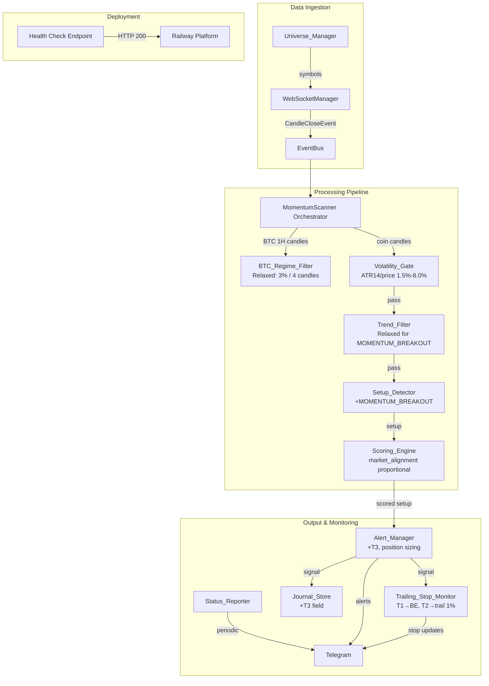

# Design Document: Strategy Improvements + Railway Deployment

## Overview

This design implements 8 strategy improvements to the existing crypto momentum scanner and adds Railway cloud deployment configuration. The improvements target specific weaknesses in the current pipeline: over-filtering by the BTC regime gate, a static symbol list, limited entry types, slow warmup due to 200-candle requirements, missing volatility pre-filtering, no trailing stop management, lack of operational status messages, and missing extended profit targets.

The changes are additive — they extend the existing event-driven pipeline (`WebSocket → EventBus → Filters → Detection → Scoring → Alerting → Journal`) without restructuring it. New components (Universe_Manager, Volatility_Gate, Trailing_Stop_Monitor, Status_Reporter) plug into the existing orchestrator. Existing components (BTC_Regime_Filter, Trend_Filter, Setup_Detector, Scoring_Engine, Alert_Manager, Journal_Store) receive targeted modifications.

Railway deployment adds configuration files and a health check endpoint to enable continuous cloud hosting as a worker process.

## Architecture

The architecture extends the existing event-driven pipeline with 4 new components and modifications to 6 existing components:



### Key Architectural Decisions

1. **BTC Regime Filter becomes a two-tier gate**: The new 3%/4-candle crash detection acts as the hard gate (blocks all signals). The existing 5-condition evaluation becomes a soft scoring input (market_alignment component). This allows signals during sideways markets while still penalizing unfavorable conditions via lower scores.

2. **Universe_Manager runs as a periodic task**: Rather than integrating into the event loop, it runs on a 60-minute timer and pushes symbol list changes to the WebSocketManager. This keeps the hot path (candle processing) unaffected.

3. **Volatility_Gate sits before Trend_Filter**: Cheap ATR calculation rejects dead/pump coins before the more expensive EMA calculations in the trend filter. This is a performance optimization.

4. **Trailing_Stop_Monitor subscribes to 15m candle events**: It reuses the existing EventBus infrastructure rather than creating a separate price feed. This keeps the architecture consistent.

5. **Status_Reporter is independent of the pipeline**: It reads state from the scanner and journal but doesn't participate in signal processing. It runs on its own timer.

6. **Health check endpoint is conditional**: Only starts when PORT env var is set (Railway sets this). Locally, no HTTP server runs.

## Components and Interfaces

### New Components

#### Universe_Manager

```python
class UniverseManager:
    """Dynamically selects and manages the set of monitored trading pairs."""

    def __init__(self, min_volume_usd: float = 50_000_000, min_price: float = 0.10):
        ...

    async def initialize(self) -> List[str]:
        """Fetch initial universe from Binance REST API. Returns symbol list."""
        ...

    async def refresh(self) -> Tuple[List[str], List[str]]:
        """Re-fetch universe. Returns (added_symbols, removed_symbols)."""
        ...

    def get_active_symbols(self) -> List[str]:
        """Return current active symbol list."""
        ...
```

**Interface with Scanner**: The orchestrator calls `initialize()` on startup and schedules `refresh()` every 60 minutes. On changes, it calls `WebSocketManager.subscribe(added)` and `WebSocketManager.unsubscribe(removed)`.

#### Volatility_Gate

```python
class VolatilityGate:
    """Pre-detection filter that validates per-coin ATR-based volatility."""

    MIN_RATIO_PCT: float = 1.5
    MAX_RATIO_PCT: float = 8.0

    def evaluate(self, atr14: float, current_price: float) -> Tuple[bool, float]:
        """
        Check if ATR14/price ratio is within acceptable bounds.
        Returns (passed, ratio_pct).
        """
        ...
```

**Interface with Scanner**: Called in `_handle_1h_event()` before trend filter evaluation. If rejected, logs to JournalStore and skips the coin.

#### Trailing_Stop_Monitor

```python
@dataclass
class MonitoredPosition:
    symbol: str
    entry_price: float
    stop_loss: float
    target_1: float
    target_2: float
    target_3: float
    signal_id: str
    started_at: datetime
    highest_since_t2: Optional[float] = None
    current_stop: float = 0.0
    t1_hit: bool = False
    t2_hit: bool = False

class TrailingStopMonitor:
    """Tracks open positions and adjusts stop-loss based on price progression."""

    def __init__(self, alert_manager: MomentumAlertManager, journal: JournalStore):
        ...

    def start_monitoring(self, signal: SetupSignal, signal_id: str) -> None:
        """Begin monitoring a new position."""
        ...

    async def on_15m_candle(self, symbol: str, candle: OHLCV) -> None:
        """Process a 15m candle close for a monitored position."""
        ...

    def get_monitored_positions(self) -> List[MonitoredPosition]:
        """Return all currently monitored positions."""
        ...
```

**Interface with Scanner**: Registered as a listener for 15m candle events. The orchestrator calls `start_monitoring()` when a signal is emitted and routes 15m events to `on_15m_candle()`.

#### Status_Reporter

```python
class StatusReporter:
    """Sends periodic status and summary messages via Telegram."""

    def __init__(self, alert_manager: MomentumAlertManager, journal: JournalStore):
        ...

    async def send_startup_message(self, symbol_count: int) -> None:
        """Send scanner started message."""
        ...

    async def send_daily_summary(self) -> None:
        """Send daily summary at 00:00 UTC."""
        ...

    async def check_idle_status(self, last_signal_time: Optional[datetime]) -> None:
        """Send idle message if no signals for 4+ hours."""
        ...
```

**Interface with Scanner**: Initialized on startup. `send_startup_message()` called after initialization. `send_daily_summary()` scheduled at 00:00 UTC. `check_idle_status()` called periodically (every 30 minutes).

### Modified Components

#### BTC_Regime_Filter (Modified)

- **New method**: `is_crashing(btc_candles_1h: List[OHLCV]) -> bool` — checks if BTC declined > 3% across last 4 1H candles
- **Modified behavior**: `should_allow_longs()` now returns `not is_crashing()` instead of requiring all 5 conditions
- **New method**: `get_alignment_score() -> float` — returns 0-100 based on how many of the 5 conditions are bullish (each = 20 points)

#### Trend_Filter (Modified)

- **New method**: `evaluate_for_momentum(candles_1h: List[OHLCV]) -> TrendResult` — only checks close > EMA20 on 1H
- **Modified**: `MIN_CANDLES` reduced from 200 to 50 for COMPRESSION_BREAKOUT and PULLBACK_CONTINUATION
- **Modified**: `evaluate()` accepts optional `setup_type` parameter to route to appropriate evaluation logic

#### Setup_Detector (Modified)

- **New function**: `detect_momentum_breakout(candles_1h: List[OHLCV]) -> Optional[ActiveSetup]`
- **New enum value**: `SetupType.MOMENTUM_BREAKOUT`
- **Modified**: All setup detection functions now calculate and include `target_3` (5R)

#### Scoring_Engine (Modified)

- **Modified**: `market_alignment` input now uses proportional scoring (N * 20 for N bullish conditions) instead of binary 0/100

#### Alert_Manager (Modified)

- **Modified**: `_format_telegram_message()` now includes T3 and position sizing recommendation

#### Journal_Store (Modified)

- **Modified**: Signal records now include `target_3` field

### Health Check Endpoint

```python
class HealthCheckServer:
    """Minimal HTTP server for Railway health checks."""

    def __init__(self, port: int, scanner: MomentumScanner):
        ...

    async def start(self) -> None:
        """Start the HTTP server."""
        ...

    async def handle_request(self, request) -> Response:
        """Return JSON with uptime and status."""
        ...
```

## Data Models

### New/Modified Dataclasses

```python
# New enum value
class SetupType(Enum):
    COMPRESSION_BREAKOUT = "compression_breakout"
    PULLBACK_CONTINUATION = "pullback_continuation"
    MOMENTUM_BREAKOUT = "momentum_breakout"  # NEW

# Modified ActiveSetup - add target_3
@dataclass
class ActiveSetup:
    # ... existing fields ...
    target_3: Optional[float] = None  # NEW: 5R target

# New dataclass for trailing stop monitoring
@dataclass
class MonitoredPosition:
    symbol: str
    entry_price: float
    stop_loss: float  # Original stop
    current_stop: float  # Current trailing stop level
    target_1: float
    target_2: float
    target_3: float
    signal_id: str
    started_at: datetime
    highest_since_t2: Optional[float] = None
    t1_hit: bool = False
    t2_hit: bool = False
    t3_hit: bool = False
    last_data_at: Optional[datetime] = None

# Modified JournalEntry - add target_3
@dataclass
class JournalEntry:
    # ... existing fields ...
    target_3: Optional[float] = None  # NEW

# New dataclass for universe management
@dataclass
class UniversePair:
    symbol: str
    volume_24h_usd: float
    current_price: float
    last_updated: datetime

# Health check response
@dataclass
class HealthStatus:
    status: str  # "healthy"
    uptime_seconds: float
    monitored_symbols: int
    active_positions: int
```

### Configuration (Environment Variables)

| Variable | Default | Description |
|----------|---------|-------------|
| `BINANCE_API_KEY` | — | Binance REST API key for universe fetching |
| `BINANCE_API_SECRET` | — | Binance REST API secret |
| `TELEGRAM_BOT_TOKEN` | — | Telegram bot token for alerts |
| `TELEGRAM_CHAT_ID` | — | Telegram chat ID for alerts |
| `PORT` | — | Health check port (set by Railway) |
| `LOG_LEVEL` | INFO | Logging level |
| `MOMENTUM_SYMBOLS` | — | Override symbols (comma-separated) |
| `UNIVERSE_REFRESH_MINUTES` | 60 | Universe refresh interval |
| `UNIVERSE_MIN_VOLUME_USD` | 50000000 | Minimum 24h volume filter |
| `UNIVERSE_MIN_PRICE` | 0.10 | Minimum price filter |
| `VOLATILITY_MIN_PCT` | 1.5 | Volatility gate lower bound |
| `VOLATILITY_MAX_PCT` | 8.0 | Volatility gate upper bound |
| `BTC_CRASH_THRESHOLD_PCT` | 3.0 | BTC crash detection threshold |
| `BTC_CRASH_CANDLE_COUNT` | 4 | Number of 1H candles for crash detection |

## Correctness Properties

*A property is a characteristic or behavior that should hold true across all valid executions of a system — essentially, a formal statement about what the system should do. Properties serve as the bridge between human-readable specifications and machine-verifiable correctness guarantees.*

### Property 1: BTC Crash Gate Correctness

*For any* sequence of 4 consecutive 1H BTC candles, the BTC_Regime_Filter SHALL block LONG setup detection if and only if the percentage decline from the open of the first candle to the close of the last candle exceeds 3%.

**Validates: Requirements 1.1, 1.2, 1.3**

### Property 2: Market Alignment Proportional Scoring

*For any* combination of the 5 regime conditions (trend, momentum, direction, volatility, breadth), the market_alignment score SHALL equal the count of bullish conditions multiplied by 20.

**Validates: Requirements 1.4, 1.5, 1.6**

### Property 3: Universe Filtering Invariants

*For any* set of USDT trading pairs returned by the Binance API, the filtered universe SHALL contain only pairs with 24h volume >= 50M USD AND price >= 0.10 USD, plus BTCUSDT regardless of its volume or price.

**Validates: Requirements 2.3, 2.4, 2.5**

### Property 4: Momentum Breakout Detection Conditions

*For any* sequence of 1H candles, a MOMENTUM_BREAKOUT signal SHALL be emitted if and only if: (a) the latest close > EMA20, (b) the last 3 candles each have a higher high than the previous, and (c) the latest volume > 2.5× the 20-period volume MA.

**Validates: Requirements 3.2, 3.3**

### Property 5: Momentum Breakout Stop-Loss Clamping

*For any* MOMENTUM_BREAKOUT signal with entry price E, the final stop-loss distance as a percentage of E SHALL be clamped to the range [0.8%, 2.5%], where the raw stop is the tighter (higher) of swing_low_3 × 0.995 and E − 1.5 × ATR14.

**Validates: Requirements 3.4, 3.5, 3.6, 3.7**

### Property 6: Trend Filter Setup-Type Routing

*For any* setup evaluation, if the setup type is MOMENTUM_BREAKOUT then the trend filter SHALL pass if and only if the 1H close > EMA20 (no 4H conditions required); if the setup type is COMPRESSION_BREAKOUT or PULLBACK_CONTINUATION then the trend filter SHALL require all 3 existing 4H conditions with a minimum of 50 candles.

**Validates: Requirements 4.1, 4.2, 4.3, 4.4, 4.5**

### Property 7: Volatility Gate Threshold

*For any* coin with ATR14 value A and current price P, the Volatility_Gate SHALL pass the coin if and only if 1.5% ≤ (A/P × 100) ≤ 8.0%.

**Validates: Requirements 5.1, 5.2, 5.3, 5.4**

### Property 8: Trailing Stop at T1 Moves to Breakeven

*For any* monitored position where the 15m candle close reaches or exceeds T1, the current stop-loss SHALL be updated to the entry price (breakeven).

**Validates: Requirements 6.2**

### Property 9: Trailing Stop After T2 Tracks Highest Price

*For any* monitored position where T2 has been hit, the trailing stop SHALL equal 99% of the highest 15m candle close observed since T2 was reached, and SHALL never decrease.

**Validates: Requirements 6.3, 6.4**

### Property 10: Exit Risk-Reward Calculation

*For any* position exit (trailing stop hit or T3 reached), the recorded actual risk-reward SHALL equal (exit_price − entry_price) / (entry_price − original_stop_loss).

**Validates: Requirements 6.6, 8.5**

### Property 11: Status Message Rate Limiting

*For any* sequence of idle checks within a 4-hour window, the Status_Reporter SHALL emit at most one "no setups" message per window.

**Validates: Requirements 7.4**

### Property 12: T3 Calculation

*For any* setup signal with entry price E and risk R (where R = E − stop_loss), T3 SHALL equal E + 5R.

**Validates: Requirements 8.1**

### Property 13: T3 Included in Signal Outputs

*For any* emitted signal, both the Telegram alert message and the journal record SHALL contain the T3 value.

**Validates: Requirements 8.2, 8.4**

## Error Handling

| Component | Error Condition | Handling Strategy |
|-----------|----------------|-------------------|
| Universe_Manager | Binance API request fails | Retain previous universe, retry after 5 minutes, log warning |
| Universe_Manager | API returns empty/malformed data | Retain previous universe, log error |
| Volatility_Gate | ATR14 cannot be calculated (< 15 candles) | Skip volatility check, allow coin through with log |
| Trailing_Stop_Monitor | No price data for 30 minutes | Log warning, continue monitoring on next candle |
| Trailing_Stop_Monitor | Position data corrupted | Remove position from monitoring, log error |
| Status_Reporter | Telegram delivery fails | Retry up to 2 times with 5-second intervals |
| Status_Reporter | Journal data unavailable for summary | Send partial summary with available data |
| Health Check | Request timeout | Respond within 1 second or return 503 |
| Scanner (SIGTERM) | Graceful shutdown signal | Complete shutdown within 10 seconds: save state, close WebSockets, stop monitors |
| Setup_Detector | Stop-loss calculation produces invalid distance | Clamp to [0.8%, 2.5%] range |
| BTC_Regime_Filter | Insufficient 1H candles for crash detection | Default to "not crashing" (allow signals) |

### Graceful Shutdown Sequence (SIGTERM)

1. Set `_running = False` to stop event processing
2. Cancel universe refresh timer
3. Save all monitored positions to state file
4. Persist trailing stop state
5. Save scanner state via StateManager
6. Close WebSocket connections
7. Stop health check server
8. Total time budget: 10 seconds

## Testing Strategy

### Unit Tests (Example-Based)

- **Universe_Manager**: Mock Binance API responses, verify filtering logic, test retry on failure
- **Status_Reporter**: Mock Telegram, verify message formatting, test daily summary content
- **Health Check**: Verify JSON response format, uptime calculation
- **Railway config files**: Verify Procfile, railway.toml, nixpacks.toml, .dockerignore content
- **SIGTERM handling**: Verify shutdown sequence completes within 10 seconds

### Property-Based Tests (Hypothesis)

The project uses Python, so property-based tests will use the **Hypothesis** library.

Each property test runs a minimum of **100 iterations** with randomized inputs.

Each test is tagged with a comment referencing the design property:
```python
# Feature: strategy-improvements-railway, Property {N}: {property_text}
```

**Properties to implement:**

1. **BTC Crash Gate** — Generate random 4-candle sequences, verify gate blocks iff decline > 3%
2. **Market Alignment Scoring** — Generate random boolean combinations (5 conditions), verify score = count × 20
3. **Universe Filtering** — Generate random pair lists with varying volume/price, verify filtering invariants
4. **Momentum Breakout Detection** — Generate random candle sequences, verify signal iff all 3 conditions met
5. **Stop-Loss Clamping** — Generate random entry/ATR/swing-low values, verify distance in [0.8%, 2.5%]
6. **Trend Filter Routing** — Generate random candle data + setup types, verify correct evaluation path
7. **Volatility Gate** — Generate random ATR/price pairs, verify pass iff ratio in [1.5%, 8.0%]
8. **Trailing Stop at T1** — Generate random price sequences reaching T1, verify stop moves to entry
9. **Trailing Stop After T2** — Generate random price sequences after T2, verify trailing = 0.99 × max
10. **Exit RR Calculation** — Generate random exit scenarios, verify RR formula
11. **Status Rate Limiting** — Generate random check sequences, verify ≤ 1 message per 4h window
12. **T3 Calculation** — Generate random entry/stop values, verify T3 = entry + 5 × risk
13. **T3 in Outputs** — Generate random signals, verify T3 present in formatted message and journal

### Integration Tests

- **Universe refresh cycle**: Mock API, verify subscribe/unsubscribe calls on symbol changes
- **Full pipeline with MOMENTUM_BREAKOUT**: Feed candle data through pipeline, verify signal emission
- **Trailing stop lifecycle**: Simulate price progression through T1 → T2 → trailing → exit
- **Railway health check**: Start server, make HTTP request, verify response
- **Graceful shutdown**: Send SIGTERM, verify state persistence and clean exit

### Test Configuration

```python
# conftest.py additions
from hypothesis import settings

settings.register_profile("ci", max_examples=200)
settings.register_profile("dev", max_examples=100)
settings.load_profile("dev")
```

### Dependencies

Add to `requirements.txt`:
```
ccxt>=4.0.0
hypothesis>=6.0.0
aiohttp>=3.9.1  # already present
```
